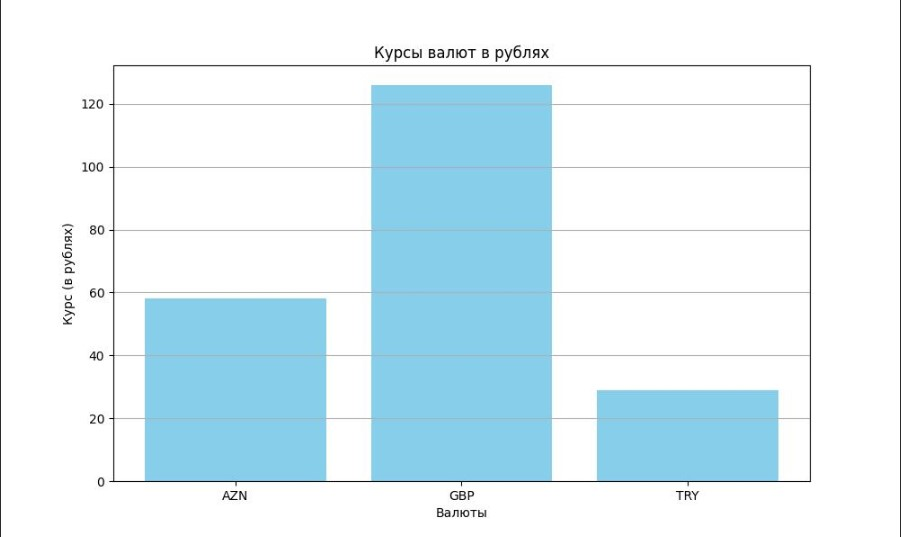

# Закаблукова Анастасия Эдуардовна ИВТ-1.1
## Лабораторная работа №6. Использование шаблона «Декоратор».

**Цель работы**
Применить паттерн декоратор и реализовать объектно-ориентированную версию программы получения курсов валют с сайта Центробанка таким образом, чтобы:
- было возможно использовать базовую версию для получения информации о валютах (возвращает словарь со структурой, описанной в одной из предыдущих лабораторных работ) (class CurrenciesRates);
- было возможно применить декоратор к базовой версии и получить данные в формате JSON (class ConcreteDecoratorJSON);
- было возможно использовать декоратор к базовой версии (CurrenciesRates) или к другому декоратору (ConcreteDecoratorJSON) и получить данные в формате csv (class ConcreteDecoratorCSV).

Код:
[код программы](main.py)

1. Пример работы запуска базовой версии:
```python
currency_rates = CurrencyRates()
result = currency_rates.get_rates(["R01035", "R01020A", "R01700J"]) #R01035
print(result)
```
Результат:  
```python
[{'AZN': {'name': 'Азербайджанский манат', 'value': '58.9525', 'nominal': 1}}, 
 {'GBP': {'name': 'Фунт стерлингов Соединенного королевства', 'value': '126.9276', 'nominal': 1}}, 
 {'TRY': {'name': 'Турецких лир', 'value': '29.0093', 'nominal': 10}}]

```

2. Пример работы применения декоратора к базовой версии и получение данных в формате JSON:
```python
json_rates = ConcreteDecoratorJSON(currency_rates)
json_result = json_rates.get_rates(["R01035", "R01020A", "R01700J"]) # R01035
print(json_result)
```
Результат:
```python
[
    {
        "AZN": {
            "name": "Азербайджанский манат",
            "value": "58.9525",
            "nominal": 1
        }
    },
    {
        "GBP": {
            "name": "Фунт стерлингов Соединенного королевства",
            "value": "126.9276",
            "nominal": 1
        }
    },
    {
        "TRY": {
            "name": "Турецких лир",
            "value": "29.0093",
            "nominal": 10
        }
    }
]
```

3. Пример работы применения декоратора к базовой версии и получение данных в формате CSV:
```python
csv_rates = ConcreteDecoratorCSV(currency_rates)
csv_result = csv_rates.get_rates(["R01035", "R01020A", "R01700J"]) # R01035
print(csv_result)
```
Результат:
```python
Code,Name,Value,Nominal
AZN,Азербайджанский манат,58.9525,1
GBP,Фунт стерлингов Соединенного королевства,126.9276,1
TRY,Турецких лир,29.0093,10
```

4. Пример работы применения декоратора к другому декоратору и получение данных в формате CSV:
```python
json_csv_rates = ConcreteDecoratorCSV(json_rates)
json_csv_result = json_csv_rates.get_rates(["R9999999", "R01020A", "R01700J"]) # R01035
print(json_csv_result)
```
Результат:
```python
Code,Name,Value,Nominal
AZN,Азербайджанский манат,58.9525,1
TRY,Турецких лир,29.0093,10
```

Также реализован метод, который визуализирует полученные данные в виде графика и сохраняется в файле 'currencies.jpg'.  
